# R for Data Science

## Data Visualisation

Learn from [R for Data Science - Data visualisation](https://r4ds.had.co.nz/data-visualisation.html) hoặc [R for Data Science (2e)](https://r4ds.hadley.nz/data-visualize)


You can learn more examples from [ggplot2](https://ggplot2.tidyverse.org/)

### Prerequisites


```R
# Install
# install.packages("gridExtra")
# install.packages("tidyverse")
# install.packages("maps")
# install.packages("mapproj")
```


```R
library(tidyverse)
library(gridExtra)
```

## First steps

### The `mpg` data frame
`mpg` contains observations collected by the US Environmental Protection Agency on 38 models of car.


```R
mpg
```


<table class="dataframe">
<caption>A tibble: 234 × 11</caption>
<thead>
	<tr><th scope=col>manufacturer</th><th scope=col>model</th><th scope=col>displ</th><th scope=col>year</th><th scope=col>cyl</th><th scope=col>trans</th><th scope=col>drv</th><th scope=col>cty</th><th scope=col>hwy</th><th scope=col>fl</th><th scope=col>class</th></tr>
	<tr><th scope=col>&lt;chr&gt;</th><th scope=col>&lt;chr&gt;</th><th scope=col>&lt;dbl&gt;</th><th scope=col>&lt;int&gt;</th><th scope=col>&lt;int&gt;</th><th scope=col>&lt;chr&gt;</th><th scope=col>&lt;chr&gt;</th><th scope=col>&lt;int&gt;</th><th scope=col>&lt;int&gt;</th><th scope=col>&lt;chr&gt;</th><th scope=col>&lt;chr&gt;</th></tr>
</thead>
<tbody>
	<tr><td>audi     </td><td>a4                </td><td>1.8</td><td>1999</td><td>4</td><td>auto(l5)  </td><td>f</td><td>18</td><td>29</td><td>p</td><td>compact</td></tr>
	<tr><td>audi     </td><td>a4                </td><td>1.8</td><td>1999</td><td>4</td><td>manual(m5)</td><td>f</td><td>21</td><td>29</td><td>p</td><td>compact</td></tr>
	<tr><td>audi     </td><td>a4                </td><td>2.0</td><td>2008</td><td>4</td><td>manual(m6)</td><td>f</td><td>20</td><td>31</td><td>p</td><td>compact</td></tr>
	<tr><td>audi     </td><td>a4                </td><td>2.0</td><td>2008</td><td>4</td><td>auto(av)  </td><td>f</td><td>21</td><td>30</td><td>p</td><td>compact</td></tr>
	<tr><td>audi     </td><td>a4                </td><td>2.8</td><td>1999</td><td>6</td><td>auto(l5)  </td><td>f</td><td>16</td><td>26</td><td>p</td><td>compact</td></tr>
	<tr><td>audi     </td><td>a4                </td><td>2.8</td><td>1999</td><td>6</td><td>manual(m5)</td><td>f</td><td>18</td><td>26</td><td>p</td><td>compact</td></tr>
	<tr><td>audi     </td><td>a4                </td><td>3.1</td><td>2008</td><td>6</td><td>auto(av)  </td><td>f</td><td>18</td><td>27</td><td>p</td><td>compact</td></tr>
	<tr><td>audi     </td><td>a4 quattro        </td><td>1.8</td><td>1999</td><td>4</td><td>manual(m5)</td><td>4</td><td>18</td><td>26</td><td>p</td><td>compact</td></tr>
	<tr><td>audi     </td><td>a4 quattro        </td><td>1.8</td><td>1999</td><td>4</td><td>auto(l5)  </td><td>4</td><td>16</td><td>25</td><td>p</td><td>compact</td></tr>
	<tr><td>audi     </td><td>a4 quattro        </td><td>2.0</td><td>2008</td><td>4</td><td>manual(m6)</td><td>4</td><td>20</td><td>28</td><td>p</td><td>compact</td></tr>
	<tr><td>audi     </td><td>a4 quattro        </td><td>2.0</td><td>2008</td><td>4</td><td>auto(s6)  </td><td>4</td><td>19</td><td>27</td><td>p</td><td>compact</td></tr>
	<tr><td>audi     </td><td>a4 quattro        </td><td>2.8</td><td>1999</td><td>6</td><td>auto(l5)  </td><td>4</td><td>15</td><td>25</td><td>p</td><td>compact</td></tr>
	<tr><td>audi     </td><td>a4 quattro        </td><td>2.8</td><td>1999</td><td>6</td><td>manual(m5)</td><td>4</td><td>17</td><td>25</td><td>p</td><td>compact</td></tr>
	<tr><td>audi     </td><td>a4 quattro        </td><td>3.1</td><td>2008</td><td>6</td><td>auto(s6)  </td><td>4</td><td>17</td><td>25</td><td>p</td><td>compact</td></tr>
	<tr><td>audi     </td><td>a4 quattro        </td><td>3.1</td><td>2008</td><td>6</td><td>manual(m6)</td><td>4</td><td>15</td><td>25</td><td>p</td><td>compact</td></tr>
	<tr><td>audi     </td><td>a6 quattro        </td><td>2.8</td><td>1999</td><td>6</td><td>auto(l5)  </td><td>4</td><td>15</td><td>24</td><td>p</td><td>midsize</td></tr>
	<tr><td>audi     </td><td>a6 quattro        </td><td>3.1</td><td>2008</td><td>6</td><td>auto(s6)  </td><td>4</td><td>17</td><td>25</td><td>p</td><td>midsize</td></tr>
	<tr><td>audi     </td><td>a6 quattro        </td><td>4.2</td><td>2008</td><td>8</td><td>auto(s6)  </td><td>4</td><td>16</td><td>23</td><td>p</td><td>midsize</td></tr>
	<tr><td>chevrolet</td><td>c1500 suburban 2wd</td><td>5.3</td><td>2008</td><td>8</td><td>auto(l4)  </td><td>r</td><td>14</td><td>20</td><td>r</td><td>suv    </td></tr>
	<tr><td>chevrolet</td><td>c1500 suburban 2wd</td><td>5.3</td><td>2008</td><td>8</td><td>auto(l4)  </td><td>r</td><td>11</td><td>15</td><td>e</td><td>suv    </td></tr>
	<tr><td>chevrolet</td><td>c1500 suburban 2wd</td><td>5.3</td><td>2008</td><td>8</td><td>auto(l4)  </td><td>r</td><td>14</td><td>20</td><td>r</td><td>suv    </td></tr>
	<tr><td>chevrolet</td><td>c1500 suburban 2wd</td><td>5.7</td><td>1999</td><td>8</td><td>auto(l4)  </td><td>r</td><td>13</td><td>17</td><td>r</td><td>suv    </td></tr>
	<tr><td>chevrolet</td><td>c1500 suburban 2wd</td><td>6.0</td><td>2008</td><td>8</td><td>auto(l4)  </td><td>r</td><td>12</td><td>17</td><td>r</td><td>suv    </td></tr>
	<tr><td>chevrolet</td><td>corvette          </td><td>5.7</td><td>1999</td><td>8</td><td>manual(m6)</td><td>r</td><td>16</td><td>26</td><td>p</td><td>2seater</td></tr>
	<tr><td>chevrolet</td><td>corvette          </td><td>5.7</td><td>1999</td><td>8</td><td>auto(l4)  </td><td>r</td><td>15</td><td>23</td><td>p</td><td>2seater</td></tr>
	<tr><td>chevrolet</td><td>corvette          </td><td>6.2</td><td>2008</td><td>8</td><td>manual(m6)</td><td>r</td><td>16</td><td>26</td><td>p</td><td>2seater</td></tr>
	<tr><td>chevrolet</td><td>corvette          </td><td>6.2</td><td>2008</td><td>8</td><td>auto(s6)  </td><td>r</td><td>15</td><td>25</td><td>p</td><td>2seater</td></tr>
	<tr><td>chevrolet</td><td>corvette          </td><td>7.0</td><td>2008</td><td>8</td><td>manual(m6)</td><td>r</td><td>15</td><td>24</td><td>p</td><td>2seater</td></tr>
	<tr><td>chevrolet</td><td>k1500 tahoe 4wd   </td><td>5.3</td><td>2008</td><td>8</td><td>auto(l4)  </td><td>4</td><td>14</td><td>19</td><td>r</td><td>suv    </td></tr>
	<tr><td>chevrolet</td><td>k1500 tahoe 4wd   </td><td>5.3</td><td>2008</td><td>8</td><td>auto(l4)  </td><td>4</td><td>11</td><td>14</td><td>e</td><td>suv    </td></tr>
	<tr><td>⋮</td><td>⋮</td><td>⋮</td><td>⋮</td><td>⋮</td><td>⋮</td><td>⋮</td><td>⋮</td><td>⋮</td><td>⋮</td><td>⋮</td></tr>
	<tr><td>toyota    </td><td>toyota tacoma 4wd</td><td>3.4</td><td>1999</td><td>6</td><td>auto(l4)  </td><td>4</td><td>15</td><td>19</td><td>r</td><td>pickup    </td></tr>
	<tr><td>toyota    </td><td>toyota tacoma 4wd</td><td>4.0</td><td>2008</td><td>6</td><td>manual(m6)</td><td>4</td><td>15</td><td>18</td><td>r</td><td>pickup    </td></tr>
	<tr><td>toyota    </td><td>toyota tacoma 4wd</td><td>4.0</td><td>2008</td><td>6</td><td>auto(l5)  </td><td>4</td><td>16</td><td>20</td><td>r</td><td>pickup    </td></tr>
	<tr><td>volkswagen</td><td>gti              </td><td>2.0</td><td>1999</td><td>4</td><td>manual(m5)</td><td>f</td><td>21</td><td>29</td><td>r</td><td>compact   </td></tr>
	<tr><td>volkswagen</td><td>gti              </td><td>2.0</td><td>1999</td><td>4</td><td>auto(l4)  </td><td>f</td><td>19</td><td>26</td><td>r</td><td>compact   </td></tr>
	<tr><td>volkswagen</td><td>gti              </td><td>2.0</td><td>2008</td><td>4</td><td>manual(m6)</td><td>f</td><td>21</td><td>29</td><td>p</td><td>compact   </td></tr>
	<tr><td>volkswagen</td><td>gti              </td><td>2.0</td><td>2008</td><td>4</td><td>auto(s6)  </td><td>f</td><td>22</td><td>29</td><td>p</td><td>compact   </td></tr>
	<tr><td>volkswagen</td><td>gti              </td><td>2.8</td><td>1999</td><td>6</td><td>manual(m5)</td><td>f</td><td>17</td><td>24</td><td>r</td><td>compact   </td></tr>
	<tr><td>volkswagen</td><td>jetta            </td><td>1.9</td><td>1999</td><td>4</td><td>manual(m5)</td><td>f</td><td>33</td><td>44</td><td>d</td><td>compact   </td></tr>
	<tr><td>volkswagen</td><td>jetta            </td><td>2.0</td><td>1999</td><td>4</td><td>manual(m5)</td><td>f</td><td>21</td><td>29</td><td>r</td><td>compact   </td></tr>
	<tr><td>volkswagen</td><td>jetta            </td><td>2.0</td><td>1999</td><td>4</td><td>auto(l4)  </td><td>f</td><td>19</td><td>26</td><td>r</td><td>compact   </td></tr>
	<tr><td>volkswagen</td><td>jetta            </td><td>2.0</td><td>2008</td><td>4</td><td>auto(s6)  </td><td>f</td><td>22</td><td>29</td><td>p</td><td>compact   </td></tr>
	<tr><td>volkswagen</td><td>jetta            </td><td>2.0</td><td>2008</td><td>4</td><td>manual(m6)</td><td>f</td><td>21</td><td>29</td><td>p</td><td>compact   </td></tr>
	<tr><td>volkswagen</td><td>jetta            </td><td>2.5</td><td>2008</td><td>5</td><td>auto(s6)  </td><td>f</td><td>21</td><td>29</td><td>r</td><td>compact   </td></tr>
	<tr><td>volkswagen</td><td>jetta            </td><td>2.5</td><td>2008</td><td>5</td><td>manual(m5)</td><td>f</td><td>21</td><td>29</td><td>r</td><td>compact   </td></tr>
	<tr><td>volkswagen</td><td>jetta            </td><td>2.8</td><td>1999</td><td>6</td><td>auto(l4)  </td><td>f</td><td>16</td><td>23</td><td>r</td><td>compact   </td></tr>
	<tr><td>volkswagen</td><td>jetta            </td><td>2.8</td><td>1999</td><td>6</td><td>manual(m5)</td><td>f</td><td>17</td><td>24</td><td>r</td><td>compact   </td></tr>
	<tr><td>volkswagen</td><td>new beetle       </td><td>1.9</td><td>1999</td><td>4</td><td>manual(m5)</td><td>f</td><td>35</td><td>44</td><td>d</td><td>subcompact</td></tr>
	<tr><td>volkswagen</td><td>new beetle       </td><td>1.9</td><td>1999</td><td>4</td><td>auto(l4)  </td><td>f</td><td>29</td><td>41</td><td>d</td><td>subcompact</td></tr>
	<tr><td>volkswagen</td><td>new beetle       </td><td>2.0</td><td>1999</td><td>4</td><td>manual(m5)</td><td>f</td><td>21</td><td>29</td><td>r</td><td>subcompact</td></tr>
	<tr><td>volkswagen</td><td>new beetle       </td><td>2.0</td><td>1999</td><td>4</td><td>auto(l4)  </td><td>f</td><td>19</td><td>26</td><td>r</td><td>subcompact</td></tr>
	<tr><td>volkswagen</td><td>new beetle       </td><td>2.5</td><td>2008</td><td>5</td><td>manual(m5)</td><td>f</td><td>20</td><td>28</td><td>r</td><td>subcompact</td></tr>
	<tr><td>volkswagen</td><td>new beetle       </td><td>2.5</td><td>2008</td><td>5</td><td>auto(s6)  </td><td>f</td><td>20</td><td>29</td><td>r</td><td>subcompact</td></tr>
	<tr><td>volkswagen</td><td>passat           </td><td>1.8</td><td>1999</td><td>4</td><td>manual(m5)</td><td>f</td><td>21</td><td>29</td><td>p</td><td>midsize   </td></tr>
	<tr><td>volkswagen</td><td>passat           </td><td>1.8</td><td>1999</td><td>4</td><td>auto(l5)  </td><td>f</td><td>18</td><td>29</td><td>p</td><td>midsize   </td></tr>
	<tr><td>volkswagen</td><td>passat           </td><td>2.0</td><td>2008</td><td>4</td><td>auto(s6)  </td><td>f</td><td>19</td><td>28</td><td>p</td><td>midsize   </td></tr>
	<tr><td>volkswagen</td><td>passat           </td><td>2.0</td><td>2008</td><td>4</td><td>manual(m6)</td><td>f</td><td>21</td><td>29</td><td>p</td><td>midsize   </td></tr>
	<tr><td>volkswagen</td><td>passat           </td><td>2.8</td><td>1999</td><td>6</td><td>auto(l5)  </td><td>f</td><td>16</td><td>26</td><td>p</td><td>midsize   </td></tr>
	<tr><td>volkswagen</td><td>passat           </td><td>2.8</td><td>1999</td><td>6</td><td>manual(m5)</td><td>f</td><td>18</td><td>26</td><td>p</td><td>midsize   </td></tr>
	<tr><td>volkswagen</td><td>passat           </td><td>3.6</td><td>2008</td><td>6</td><td>auto(s6)  </td><td>f</td><td>17</td><td>26</td><td>p</td><td>midsize   </td></tr>
</tbody>
</table>


```R
?mpg
```

    mpg                  package:ggplot2                   R Documentation
    
    _F_u_e_l _e_c_o_n_o_m_y _d_a_t_a _f_r_o_m _1_9_9_9 _t_o _2_0_0_8 _f_o_r _3_8 _p_o_p_u_l_a_r _m_o_d_e_l_s _o_f _c_a_r_s
    
    _D_e_s_c_r_i_p_t_i_o_n:
    
         This dataset contains a subset of the fuel economy data that the
         EPA makes available on <https://fueleconomy.gov/>. It contains
         only models which had a new release every year between 1999 and
         2008 - this was used as a proxy for the popularity of the car.
    
    _U_s_a_g_e:
    
         mpg
         
    _F_o_r_m_a_t:
    
         A data frame with 234 rows and 11 variables:
    
         manufacturer manufacturer name
    
         model model name
    
         displ engine displacement, in litres
    
         year year of manufacture
    
         cyl number of cylinders
    
         trans type of transmission
    
         drv the type of drive train, where f = front-wheel drive, r = rear
              wheel drive, 4 = 4wd
    
         cty city miles per gallon
    
         hwy highway miles per gallon
    
         fl fuel type
    
         class "type" of car
    

## Creating a ggplot


```R
ggplot(data = mpg) +                                #  creates an empty graph, using the dataset
  geom_point(mapping = aes(x = displ, y = hwy,  color = class, size= class, alpha = class))
# Each geom function in ggplot2 takes a mapping argument. 
# This defines how variables in your dataset are mapped to visual properties. 
# The mapping argument is always paired with aes(), and the x and y arguments of aes() 
# specify which variables to map to the x and y axes. 
# ggplot2 looks for the mapped variables in the data argument, in this case, mpg.
```

    Warning message:
    "Using size for a discrete variable is not advised."
    Warning message:
    "Using alpha for a discrete variable is not advised."
    


    
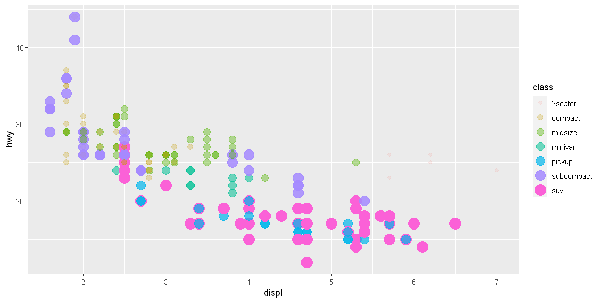
    


### A graphing template
```
ggplot(data = mpg) + 
  geom_point(mapping = aes(x = displ, y = hwy))
```

## Aesthetic mappings


```R
# Left
p1 <- ggplot(data = mpg) + 
  geom_point(mapping = aes(x = displ, y = hwy, alpha = class))

# Right
p2 <- ggplot(data = mpg) + 
  geom_point(mapping = aes(x = displ, y = hwy, shape = class))

options(repr.plot.width = 10, repr.plot.height = 5)
grid.arrange(p1, p2, ncol=2)
```

    Warning message:
    "Using alpha for a discrete variable is not advised."
    Warning message:
    "The shape palette can deal with a maximum of 6 discrete values because more
    than 6 becomes difficult to discriminate
    ℹ you have requested 7 values. Consider specifying shapes manually if you need
      that many have them."
    Warning message:
    "Removed 62 rows containing missing values (`geom_point()`)."
    


    
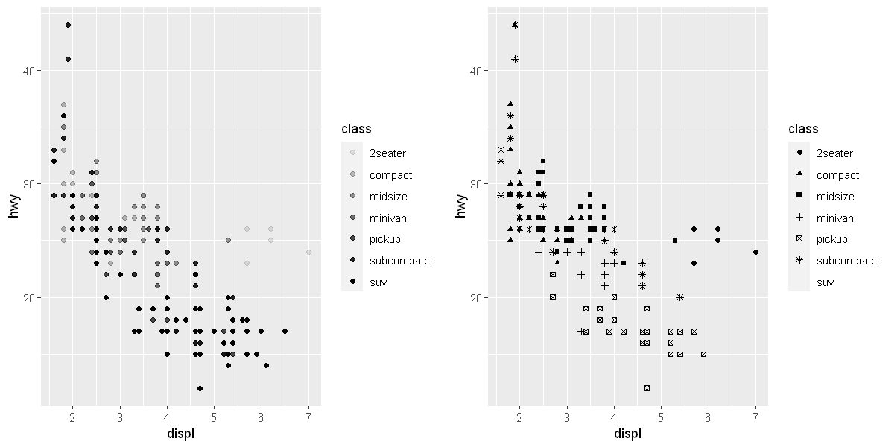
    


```R
ggplot(data = mpg) + 
  geom_point(mapping = aes(x = displ, y = hwy), color = "blue")
```


    
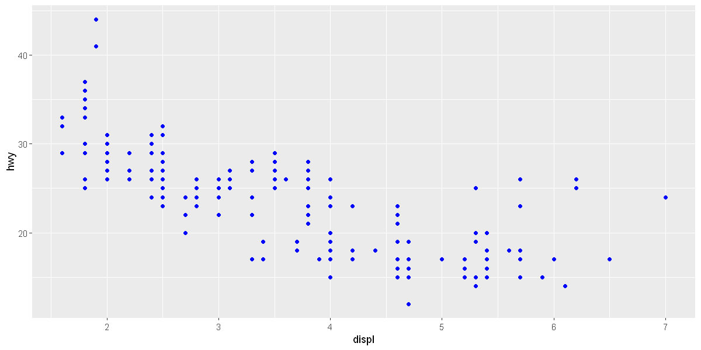
    


```R
?geom_point

```

    geom_point               package:ggplot2               R Documentation
    
    _P_o_i_n_t_s
    
    _D_e_s_c_r_i_p_t_i_o_n:
    
         The point geom is used to create scatterplots. The scatterplot is
         most useful for displaying the relationship between two continuous
         variables. It can be used to compare one continuous and one
         categorical variable, or two categorical variables, but a
         variation like 'geom_jitter()', 'geom_count()', or 'geom_bin2d()'
         is usually more appropriate. A _bubblechart_ is a scatterplot with
         a third variable mapped to the size of points.
    
    _U_s_a_g_e:
    
         geom_point(
           mapping = NULL,
           data = NULL,
           stat = "identity",
           position = "identity",
           ...,
           na.rm = FALSE,
           show.legend = NA,
           inherit.aes = TRUE
         )
         
    _A_r_g_u_m_e_n_t_s:
    
     mapping: Set of aesthetic mappings created by 'aes()'. If specified
              and 'inherit.aes = TRUE' (the default), it is combined with
              the default mapping at the top level of the plot. You must
              supply 'mapping' if there is no plot mapping.
    
        data: The data to be displayed in this layer. There are three
              options:
    
              If 'NULL', the default, the data is inherited from the plot
              data as specified in the call to 'ggplot()'.
    
              A 'data.frame', or other object, will override the plot data.
              All objects will be fortified to produce a data frame. See
              'fortify()' for which variables will be created.
    
              A 'function' will be called with a single argument, the plot
              data. The return value must be a 'data.frame', and will be
              used as the layer data. A 'function' can be created from a
              'formula' (e.g. '~ head(.x, 10)').
    
        stat: The statistical transformation to use on the data for this
              layer, either as a 'ggproto' 'Geom' subclass or as a string
              naming the stat stripped of the 'stat_' prefix (e.g.
              '"count"' rather than '"stat_count"')
    
    position: Position adjustment, either as a string naming the adjustment
              (e.g. '"jitter"' to use 'position_jitter'), or the result of
              a call to a position adjustment function. Use the latter if
              you need to change the settings of the adjustment.
    
         ...: Other arguments passed on to 'layer()'. These are often
              aesthetics, used to set an aesthetic to a fixed value, like
              'colour = "red"' or 'size = 3'. They may also be parameters
              to the paired geom/stat.
    
       na.rm: If 'FALSE', the default, missing values are removed with a
              warning. If 'TRUE', missing values are silently removed.
    
    show.legend: logical. Should this layer be included in the legends?
              'NA', the default, includes if any aesthetics are mapped.
              'FALSE' never includes, and 'TRUE' always includes. It can
              also be a named logical vector to finely select the
              aesthetics to display.
    
    inherit.aes: If 'FALSE', overrides the default aesthetics, rather than
              combining with them. This is most useful for helper functions
              that define both data and aesthetics and shouldn't inherit
              behaviour from the default plot specification, e.g.
              'borders()'.
    
    _O_v_e_r_p_l_o_t_t_i_n_g:
    
         The biggest potential problem with a scatterplot is overplotting:
         whenever you have more than a few points, points may be plotted on
         top of one another. This can severely distort the visual
         appearance of the plot. There is no one solution to this problem,
         but there are some techniques that can help. You can add
         additional information with 'geom_smooth()', 'geom_quantile()' or
         'geom_density_2d()'. If you have few unique 'x' values,
         'geom_boxplot()' may also be useful.
    
         Alternatively, you can summarise the number of points at each
         location and display that in some way, using 'geom_count()',
         'geom_hex()', or 'geom_density2d()'.
    
         Another technique is to make the points transparent (e.g.
         'geom_point(alpha = 0.05)') or very small (e.g. 'geom_point(shape
         = ".")').
    
    _A_e_s_t_h_e_t_i_c_s:
    
         'geom_point()' understands the following aesthetics (required
         aesthetics are in bold):
    
            * *'x'*
    
            * *'y'*
    
            * 'alpha'
    
            * 'colour'
    
            * 'fill'
    
            * 'group'
    
            * 'shape'
    
            * 'size'
    
            * 'stroke'
    
         Learn more about setting these aesthetics in
         'vignette("ggplot2-specs")'.
    
    _E_x_a_m_p_l_e_s:
    
         p <- ggplot(mtcars, aes(wt, mpg))
         p + geom_point()
         
         # Add aesthetic mappings
         p + geom_point(aes(colour = factor(cyl)))
         p + geom_point(aes(shape = factor(cyl)))
         # A "bubblechart":
         p + geom_point(aes(size = qsec))
         
         # Set aesthetics to fixed value
         ggplot(mtcars, aes(wt, mpg)) + geom_point(colour = "red", size = 3)
         
         
         # Varying alpha is useful for large datasets
         d <- ggplot(diamonds, aes(carat, price))
         d + geom_point(alpha = 1/10)
         d + geom_point(alpha = 1/20)
         d + geom_point(alpha = 1/100)
         
         
         # For shapes that have a border (like 21), you can colour the inside and
         # outside separately. Use the stroke aesthetic to modify the width of the
         # border
         ggplot(mtcars, aes(wt, mpg)) +
           geom_point(shape = 21, colour = "black", fill = "white", size = 5, stroke = 5)
         
         
         # You can create interesting shapes by layering multiple points of
         # different sizes
         p <- ggplot(mtcars, aes(mpg, wt, shape = factor(cyl)))
         p +
           geom_point(aes(colour = factor(cyl)), size = 4) +
           geom_point(colour = "grey90", size = 1.5)
         p +
           geom_point(colour = "black", size = 4.5) +
           geom_point(colour = "pink", size = 4) +
           geom_point(aes(shape = factor(cyl)))
         
         # geom_point warns when missing values have been dropped from the data set
         # and not plotted, you can turn this off by setting na.rm = TRUE
         set.seed(1)
         mtcars2 <- transform(mtcars, mpg = ifelse(runif(32) < 0.2, NA, mpg))
         ggplot(mtcars2, aes(wt, mpg)) +
           geom_point()
         ggplot(mtcars2, aes(wt, mpg)) +
           geom_point(na.rm = TRUE)
         


```R
     p <- ggplot(mtcars, aes(mpg, wt, shape = factor(cyl)))
     p1 <- p +
       geom_point(aes(colour = factor(cyl)), size = 4) +
       geom_point(colour = "grey90", size = 1.5)
      p2 <- p +
       geom_point(colour = "black", size = 4.5) +
       geom_point(colour = "pink", size = 4) +
       geom_point(aes(shape = factor(cyl)))

options(repr.plot.width = 10, repr.plot.height = 5)
grid.arrange(p1, p2, ncol=2)
```


    
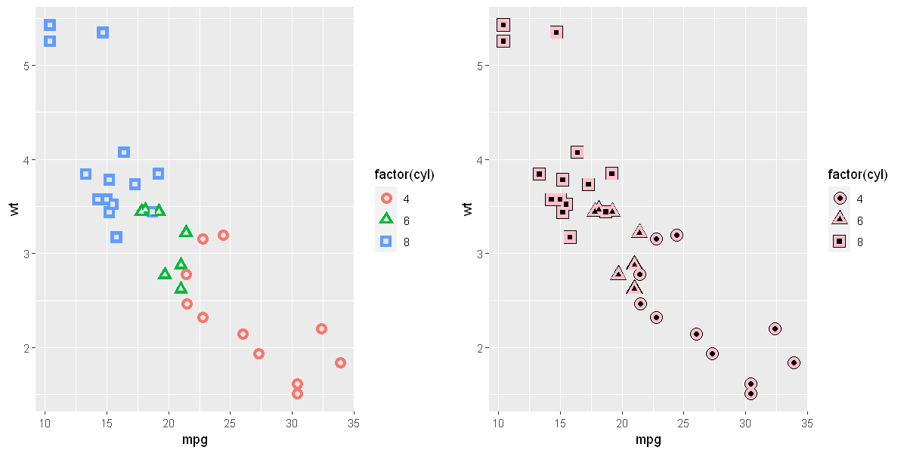
    


```R
# exercise 3.3
ggplot(data = mpg) +                                #  creates an empty graph, using the dataset
  geom_point(mapping = aes(x = displ, y = hwy,  color = displ<5))
options(repr.plot.width = 10, repr.plot.height = 5)
```


    
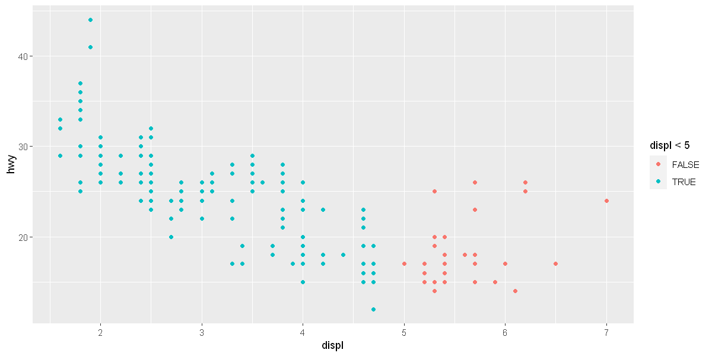
    


## Facets

To facet your plot by a single variable, use `facet_wrap()`. The first argument of `facet_wrap()` should be a formula, which you create with `~` followed by a variable name (*here “formula” is the name of a data structure in R, not a synonym for “equation”*). The variable that you pass to `facet_wrap()` should be **discrete**.


```R
ggplot(data = mpg) + 
  geom_point(mapping = aes(x = displ, y = hwy, color = class)) + 
  facet_wrap(~ class, nrow = 2)
```


    
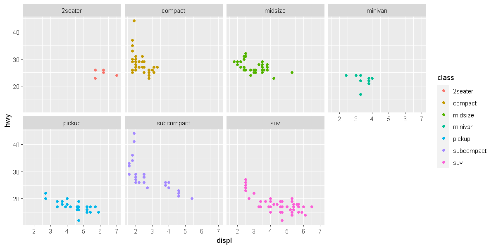
    


To facet your plot on the combination of two variables, add `facet_grid()` to your plot call. The first argument of `facet_grid()` is also a formula. This time the formula should contain two variable names separated by a `~`.


```R
ggplot(data = mpg) + 
  geom_point(mapping = aes(x = displ, y = hwy, color = class)) + 
  facet_grid(drv ~ cyl)
```


    
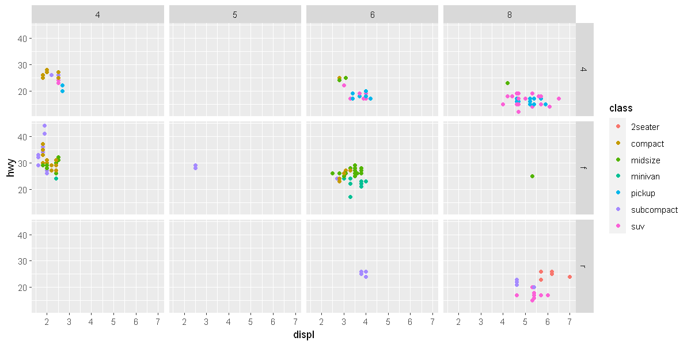
    


If you prefer to not facet in the rows or columns dimension, use a `.` instead of a variable name, e.g. `+ facet_grid(. ~ cyl)`.


```R
p1 <- ggplot(data = mpg) + 
  geom_point(mapping = aes(x = displ, y = hwy, color = class)) +
  facet_grid(drv ~ .)

p2 <- ggplot(data = mpg) + 
  geom_point(mapping = aes(x = displ, y = hwy, color = class)) +
  facet_grid(. ~ cyl)

options(repr.plot.width = 10, repr.plot.height = 5)
grid.arrange(p1, p2, ncol=2)
```


    
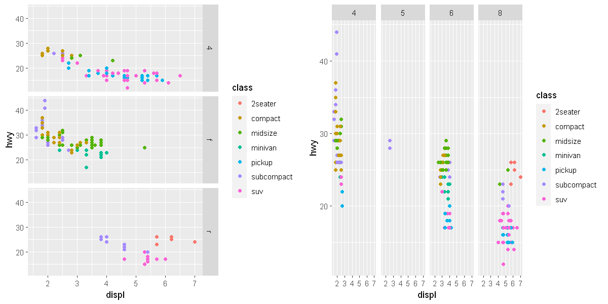
    


## Geometric objects

A geom is the geometrical object that a plot uses to represent data. People often describe plots by the type of geom that the plot uses. For example, bar charts use bar geoms, line charts use line geoms, boxplots use boxplot geoms, and so on. To change the geom in your plot, change the geom function that you add to ggplot(). For instance, to make the plots above, you can use this 


```R
# left
p1 <- ggplot(data = mpg) + 
  geom_point(mapping = aes(x = displ, y = hwy))

# right
p2 <- ggplot(data = mpg) + 
  geom_smooth(mapping = aes(x = displ, y = hwy))

options(repr.plot.width = 10, repr.plot.height = 5)
grid.arrange(p1, p2, ncol=2)
```

    `geom_smooth()` using method = 'loess' and formula = 'y ~ x'
    


    
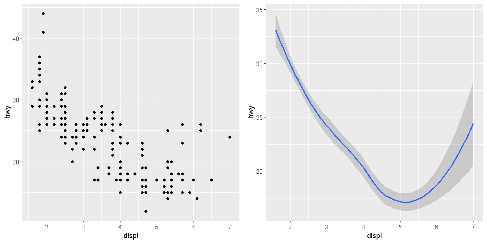
    


```R
ggplot(data = mpg) + 
  geom_smooth(mapping = aes(x = displ, y = hwy, linetype = drv))
```

    `geom_smooth()` using method = 'loess' and formula = 'y ~ x'
    


    
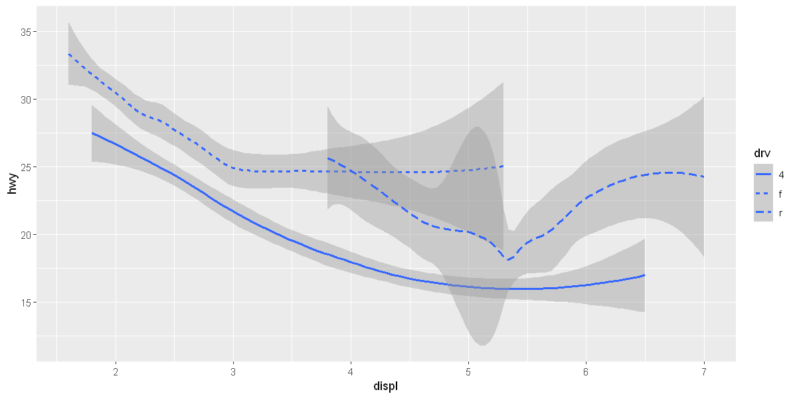
    


ggplot2 provides over 40 geoms, and extension packages provide even more [see examples](https://exts.ggplot2.tidyverse.org/gallery/) or find more in the [cheetsheets](http://rstudio.com/resources/cheatsheets)


```R
? geom_smooth
```

    geom_smooth              package:ggplot2               R Documentation
    
    _S_m_o_o_t_h_e_d _c_o_n_d_i_t_i_o_n_a_l _m_e_a_n_s
    
    _D_e_s_c_r_i_p_t_i_o_n:
    
         Aids the eye in seeing patterns in the presence of overplotting.
         'geom_smooth()' and 'stat_smooth()' are effectively aliases: they
         both use the same arguments. Use 'stat_smooth()' if you want to
         display the results with a non-standard geom.
    
    _U_s_a_g_e:
    
         geom_smooth(
           mapping = NULL,
           data = NULL,
           stat = "smooth",
           position = "identity",
           ...,
           method = NULL,
           formula = NULL,
           se = TRUE,
           na.rm = FALSE,
           orientation = NA,
           show.legend = NA,
           inherit.aes = TRUE
         )
         
         stat_smooth(
           mapping = NULL,
           data = NULL,
           geom = "smooth",
           position = "identity",
           ...,
           method = NULL,
           formula = NULL,
           se = TRUE,
           n = 80,
           span = 0.75,
           fullrange = FALSE,
           level = 0.95,
           method.args = list(),
           na.rm = FALSE,
           orientation = NA,
           show.legend = NA,
           inherit.aes = TRUE
         )
         
    _A_r_g_u_m_e_n_t_s:
    
     mapping: Set of aesthetic mappings created by 'aes()'. If specified
              and 'inherit.aes = TRUE' (the default), it is combined with
              the default mapping at the top level of the plot. You must
              supply 'mapping' if there is no plot mapping.
    
        data: The data to be displayed in this layer. There are three
              options:
    
              If 'NULL', the default, the data is inherited from the plot
              data as specified in the call to 'ggplot()'.
    
              A 'data.frame', or other object, will override the plot data.
              All objects will be fortified to produce a data frame. See
              'fortify()' for which variables will be created.
    
              A 'function' will be called with a single argument, the plot
              data. The return value must be a 'data.frame', and will be
              used as the layer data. A 'function' can be created from a
              'formula' (e.g. '~ head(.x, 10)').
    
    position: Position adjustment, either as a string naming the adjustment
              (e.g. '"jitter"' to use 'position_jitter'), or the result of
              a call to a position adjustment function. Use the latter if
              you need to change the settings of the adjustment.
    
         ...: Other arguments passed on to 'layer()'. These are often
              aesthetics, used to set an aesthetic to a fixed value, like
              'colour = "red"' or 'size = 3'. They may also be parameters
              to the paired geom/stat.
    
      method: Smoothing method (function) to use, accepts either 'NULL' or
              a character vector, e.g. '"lm"', '"glm"', '"gam"', '"loess"'
              or a function, e.g. 'MASS::rlm' or 'mgcv::gam', 'stats::lm',
              or 'stats::loess'. '"auto"' is also accepted for backwards
              compatibility.  It is equivalent to 'NULL'.
    
              For 'method = NULL' the smoothing method is chosen based on
              the size of the largest group (across all panels).
              'stats::loess()' is used for less than 1,000 observations;
              otherwise 'mgcv::gam()' is used with 'formula = y ~ s(x, bs =
              "cs")' with 'method = "REML"'. Somewhat anecdotally, 'loess'
              gives a better appearance, but is O(N^2) in memory, so does
              not work for larger datasets.
    
              If you have fewer than 1,000 observations but want to use the
              same 'gam()' model that 'method = NULL' would use, then set
              method = "gam", formula = y ~ s(x, bs = "cs").
    
     formula: Formula to use in smoothing function, eg. 'y ~ x', 'y ~
              poly(x, 2)', 'y ~ log(x)'. 'NULL' by default, in which case
              'method = NULL' implies 'formula = y ~ x' when there are
              fewer than 1,000 observations and 'formula = y ~ s(x, bs =
              "cs")' otherwise.
    
          se: Display confidence interval around smooth? ('TRUE' by
              default, see 'level' to control.)
    
       na.rm: If 'FALSE', the default, missing values are removed with a
              warning. If 'TRUE', missing values are silently removed.
    
    orientation: The orientation of the layer. The default ('NA')
              automatically determines the orientation from the aesthetic
              mapping. In the rare event that this fails it can be given
              explicitly by setting 'orientation' to either '"x"' or '"y"'.
              See the _Orientation_ section for more detail.
    
    show.legend: logical. Should this layer be included in the legends?
              'NA', the default, includes if any aesthetics are mapped.
              'FALSE' never includes, and 'TRUE' always includes. It can
              also be a named logical vector to finely select the
              aesthetics to display.
    
    inherit.aes: If 'FALSE', overrides the default aesthetics, rather than
              combining with them. This is most useful for helper functions
              that define both data and aesthetics and shouldn't inherit
              behaviour from the default plot specification, e.g.
              'borders()'.
    
    geom, stat: Use to override the default connection between
              'geom_smooth()' and 'stat_smooth()'.
    
           n: Number of points at which to evaluate smoother.
    
        span: Controls the amount of smoothing for the default loess
              smoother. Smaller numbers produce wigglier lines, larger
              numbers produce smoother lines. Only used with loess, i.e.
              when 'method = "loess"', or when 'method = NULL' (the
              default) and there are fewer than 1,000 observations.
    
    fullrange: If 'TRUE', the smoothing line gets expanded to the range of
              the plot, potentially beyond the data. This does not extend
              the line into any additional padding created by 'expansion'.
    
       level: Level of confidence interval to use (0.95 by default).
    
    method.args: List of additional arguments passed on to the modelling
              function defined by 'method'.
    
    _D_e_t_a_i_l_s:
    
         Calculation is performed by the (currently undocumented)
         'predictdf()' generic and its methods.  For most methods the
         standard error bounds are computed using the 'predict()' method -
         the exceptions are 'loess()', which uses a t-based approximation,
         and 'glm()', where the normal confidence interval is constructed
         on the link scale and then back-transformed to the response scale.
    
    _O_r_i_e_n_t_a_t_i_o_n:
    
         This geom treats each axis differently and, thus, can thus have
         two orientations. Often the orientation is easy to deduce from a
         combination of the given mappings and the types of positional
         scales in use. Thus, ggplot2 will by default try to guess which
         orientation the layer should have. Under rare circumstances, the
         orientation is ambiguous and guessing may fail. In that case the
         orientation can be specified directly using the 'orientation'
         parameter, which can be either '"x"' or '"y"'. The value gives the
         axis that the geom should run along, '"x"' being the default
         orientation you would expect for the geom.
    
    _A_e_s_t_h_e_t_i_c_s:
    
         'geom_smooth()' understands the following aesthetics (required
         aesthetics are in bold):
    
            * *'x'*
    
            * *'y'*
    
            * 'alpha'
    
            * 'colour'
    
            * 'fill'
    
            * 'group'
    
            * 'linetype'
    
            * 'linewidth'
    
            * 'weight'
    
            * 'ymax'
    
            * 'ymin'
    
         Learn more about setting these aesthetics in
         'vignette("ggplot2-specs")'.
    
    _C_o_m_p_u_t_e_d _v_a_r_i_a_b_l_e_s:
    
         These are calculated by the 'stat' part of layers and can be
         accessed with delayed evaluation. 'stat_smooth()' provides the
         following variables, some of which depend on the orientation:
    
            * 'after_stat(y)' _or_ 'after_stat(x)'
              Predicted value.
    
            * 'after_stat(ymin)' _or_ 'after_stat(xmin)'
              Lower pointwise confidence interval around the mean.
    
            * 'after_stat(ymax)' _or_ 'after_stat(xmax)'
              Upper pointwise confidence interval around the mean.
    
            * 'after_stat(se)'
              Standard error.
    
    _S_e_e _A_l_s_o:
    
         See individual modelling functions for more details: 'lm()' for
         linear smooths, 'glm()' for generalised linear smooths, and
         'loess()' for local smooths.
    
    _E_x_a_m_p_l_e_s:
    
         ggplot(mpg, aes(displ, hwy)) +
           geom_point() +
           geom_smooth()
         
         # If you need the fitting to be done along the y-axis set the orientation
         ggplot(mpg, aes(displ, hwy)) +
           geom_point() +
           geom_smooth(orientation = "y")
         
         # Use span to control the "wiggliness" of the default loess smoother.
         # The span is the fraction of points used to fit each local regression:
         # small numbers make a wigglier curve, larger numbers make a smoother curve.
         ggplot(mpg, aes(displ, hwy)) +
           geom_point() +
           geom_smooth(span = 0.3)
         
         # Instead of a loess smooth, you can use any other modelling function:
         ggplot(mpg, aes(displ, hwy)) +
           geom_point() +
           geom_smooth(method = lm, se = FALSE)
         
         ggplot(mpg, aes(displ, hwy)) +
           geom_point() +
           geom_smooth(method = lm, formula = y ~ splines::bs(x, 3), se = FALSE)
         
         # Smooths are automatically fit to each group (defined by categorical
         # aesthetics or the group aesthetic) and for each facet.
         
         ggplot(mpg, aes(displ, hwy, colour = class)) +
           geom_point() +
           geom_smooth(se = FALSE, method = lm)
         ggplot(mpg, aes(displ, hwy)) +
           geom_point() +
           geom_smooth(span = 0.8) +
           facet_wrap(~drv)
         
         
         binomial_smooth <- function(...) {
           geom_smooth(method = "glm", method.args = list(family = "binomial"), ...)
         }
         # To fit a logistic regression, you need to coerce the values to
         # a numeric vector lying between 0 and 1.
         ggplot(rpart::kyphosis, aes(Age, Kyphosis)) +
           geom_jitter(height = 0.05) +
           binomial_smooth()
         
         ggplot(rpart::kyphosis, aes(Age, as.numeric(Kyphosis) - 1)) +
           geom_jitter(height = 0.05) +
           binomial_smooth()
         
         ggplot(rpart::kyphosis, aes(Age, as.numeric(Kyphosis) - 1)) +
           geom_jitter(height = 0.05) +
           binomial_smooth(formula = y ~ splines::ns(x, 2))
         
         # But in this case, it's probably better to fit the model yourself
         # so you can exercise more control and see whether or not it's a good model.
         


```R
binomial_smooth <- function(...) {
    geom_smooth(method = "glm", method.args = list(family = "binomial"), ...)
}
# To fit a logistic regression, you need to coerce the values to
# a numeric vector lying between 0 and 1.
ggplot(rpart::kyphosis, aes(Age, as.numeric(Kyphosis) - 1)) +
    geom_jitter(height = 0.05) +
    binomial_smooth(formula = y ~ splines::ns(x, 2))

options(repr.plot.width = 10, repr.plot.height = 5)
```


    
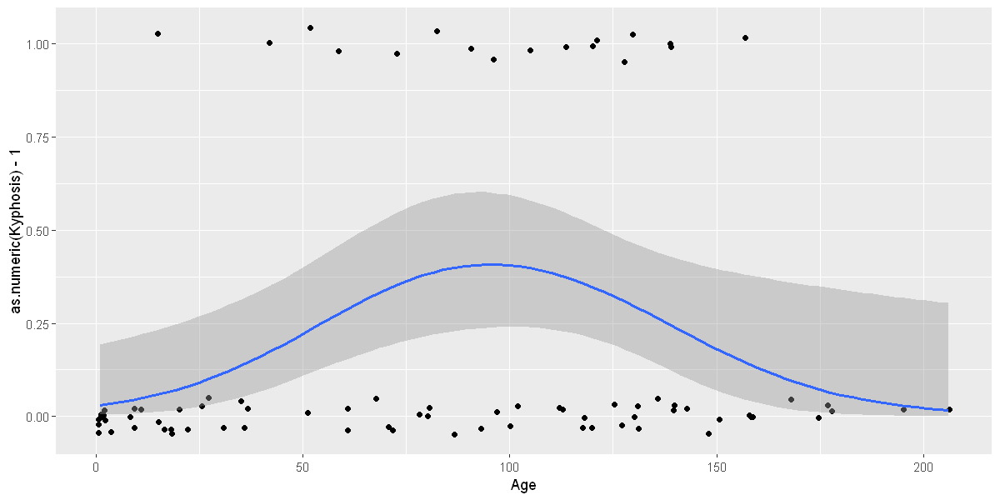
    


```R
p1 = ggplot(data = mpg) +
  geom_smooth(mapping = aes(x = displ, y = hwy))
              
p2 = ggplot(data = mpg) +
  geom_smooth(mapping = aes(x = displ, y = hwy, group = drv))
    
p3 = ggplot(data = mpg) +
  geom_smooth(
    mapping = aes(x = displ, y = hwy, color = drv),
    show.legend = FALSE
  )

options(repr.plot.width = 30, repr.plot.height = 5)
grid.arrange(p1, p2, p3, ncol=3)
```

    `geom_smooth()` using method = 'loess' and formula = 'y ~ x'
    `geom_smooth()` using method = 'loess' and formula = 'y ~ x'
    `geom_smooth()` using method = 'loess' and formula = 'y ~ x'
    


    
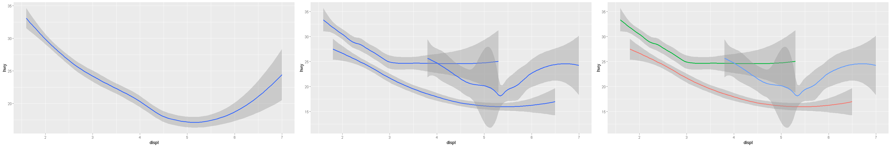
    


To display multiple geoms in the same plot, add multiple geom functions to `ggplot()`:


```R
p1 <- ggplot(data = mpg) + 
  geom_point(mapping = aes(x = displ, y = hwy)) +
  geom_smooth(mapping = aes(x = displ, y = hwy))    # some duplication in the code here!

p2 <- ggplot(data = mpg, mapping = aes(x = displ, y = cty)) +   # that is better!
  geom_point() + 
  geom_smooth()

options(repr.plot.width = 20, repr.plot.height = 5)
grid.arrange(p1, p2, ncol=2)
```

    `geom_smooth()` using method = 'loess' and formula = 'y ~ x'
    `geom_smooth()` using method = 'loess' and formula = 'y ~ x'
    


    
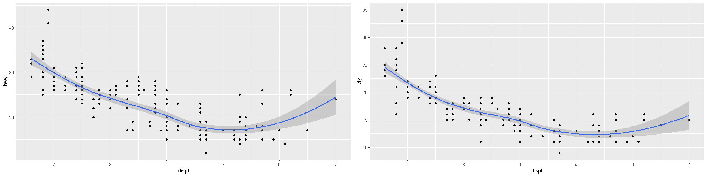
    


```R
ggplot(data = mpg, mapping = aes(x = displ, y = hwy)) + 
  geom_point(mapping = aes(color = class)) + 
  geom_smooth()

options(repr.plot.width = 10, repr.plot.height = 5)
```

    `geom_smooth()` using method = 'loess' and formula = 'y ~ x'
    


    
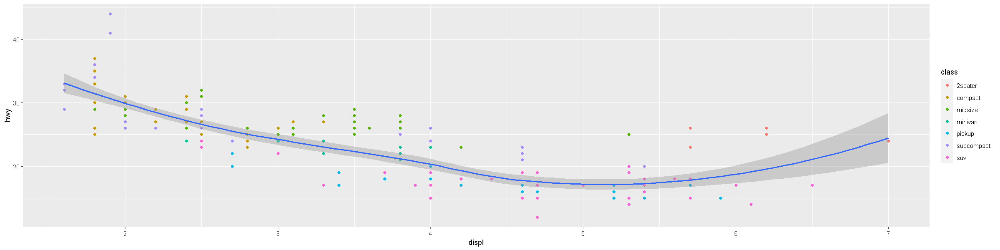
    


```R
ggplot(data = mpg, mapping = aes(x = displ, y = hwy)) + 
  geom_point(mapping = aes(color = class)) + 
  geom_smooth(data = filter(mpg, class == "subcompact"), se = FALSE)
```

    `geom_smooth()` using method = 'loess' and formula = 'y ~ x'
    


    

    


```R
ggplot(data = mpg, mapping = aes(x = displ, y = hwy, color = drv)) + 
  geom_point() + 
  geom_smooth(se = FALSE)
```

    `geom_smooth()` using method = 'loess' and formula = 'y ~ x'
    


    
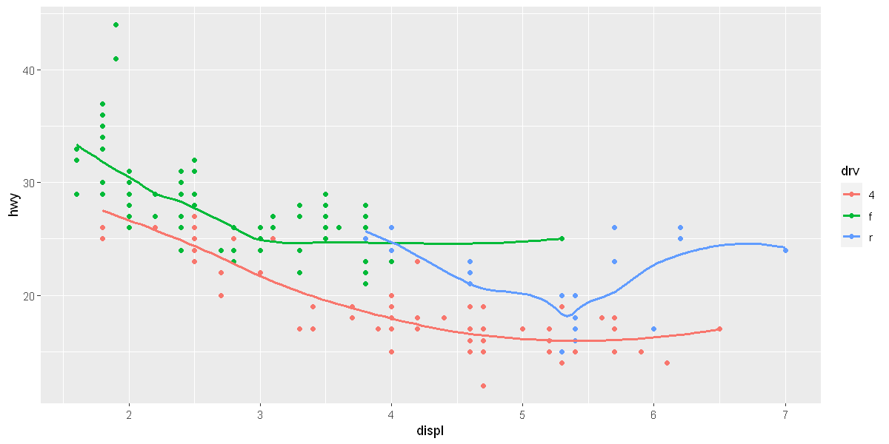
    


```R
p1 <- ggplot(data = mpg, mapping = aes(x = displ, y = hwy)) + 
  geom_point() + 
  geom_smooth(se = FALSE)

p2 <- ggplot(data = mpg, mapping = aes(x = displ, y = hwy)) + 
  geom_point() + 
  geom_smooth(mapping = aes(x = displ, y = hwy, group = drv), se = FALSE)

p3 <- ggplot(data = mpg, mapping = aes(x = displ, y = hwy, color = drv)) + 
  geom_point(size = 4) + 
  geom_smooth(mapping = aes(x = displ, y = hwy, group = drv, linewidth = 2), se = FALSE)

p4 <- ggplot(data = mpg, mapping = aes(x = displ, y = hwy)) + 
  geom_point(mapping = aes(color = drv, size = 4)) + 
  geom_smooth(se = FALSE)

p5 <- ggplot(data = mpg, mapping = aes(x = displ, y = hwy, color = drv)) + 
  geom_point(size = 4) + 
  geom_smooth(mapping = aes(x = displ, y = hwy, group = drv, linewidth = 2, lty = drv), se = FALSE)

p6 <- ggplot(data = mpg, mapping = aes(x = displ, y = hwy, fill = drv)) + 
  geom_point(shape=21, color="white", size=4)  # alpha = factor(cyl)

options(repr.plot.width = 20, repr.plot.height = 15)
grid.arrange(p1, p2, p3, p4, p5, p6, ncol=2, nrow = 3)
```

    `geom_smooth()` using method = 'loess' and formula = 'y ~ x'
    `geom_smooth()` using method = 'loess' and formula = 'y ~ x'
    `geom_smooth()` using method = 'loess' and formula = 'y ~ x'
    `geom_smooth()` using method = 'loess' and formula = 'y ~ x'
    `geom_smooth()` using method = 'loess' and formula = 'y ~ x'
    


    
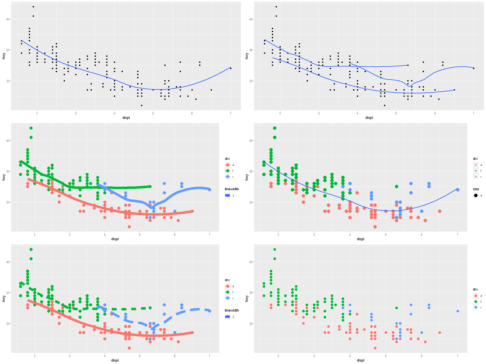
    


##  Statistical transformations

The diamonds dataset comes in `ggplot2` and contains information about `~54,000` diamonds, including the `price`, `carat`, `color`, `clarity`, and `cut` of each diamond.

Many graphs, like scatterplots, plot the raw values of your dataset. Other graphs, like bar charts, calculate new values to plot:

* bar charts, histograms, and frequency polygons bin your data and then plot bin counts, the number of points that fall in each bin.

* smoothers fit a model to your data and then plot predictions from the model.

* boxplots compute a robust summary of the distribution and then display a specially formatted box.

The algorithm used to calculate new values for a graph is called a `stat`, short for **statistical transformation**. 

Every `geom` has a default stat; and every stat has a default `geom`. This means that you can typically use geoms without worrying about the underlying statistical transformation. 


```R
ggplot(data = diamonds) + 
  geom_bar(mapping = aes(x = cut))

options(repr.plot.width = 10, repr.plot.height = 5)
```


    
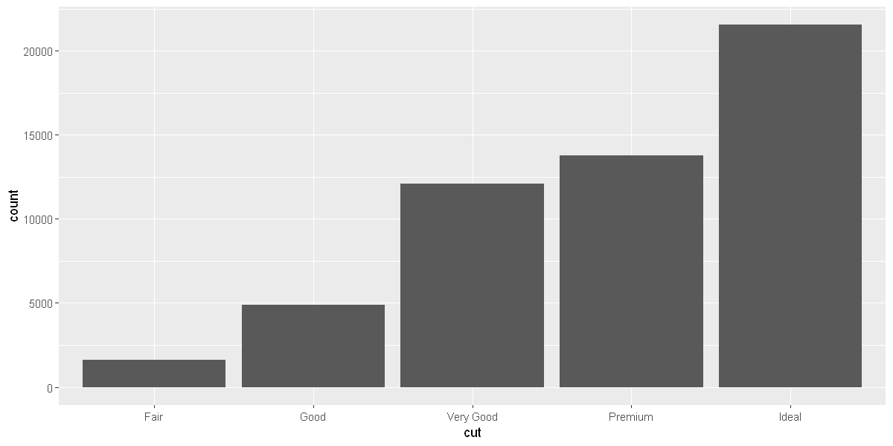
    


```R
#  we should use a stat explicitly, and there are 3 reasons:
# 1. to override the default stat, by default it is stat_count()
demo <- tribble(
  ~cut,         ~freq,
  "Fair",       1610,
  "Good",       4906,
  "Very Good",  12082,
  "Premium",    13791,
  "Ideal",      21551
)

ggplot(data = demo) +
  geom_bar(mapping = aes(x = cut, y = freq), stat = "identity")
```


    
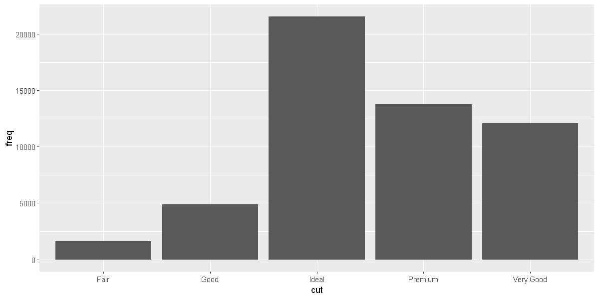
    


```R
# 2. to override the default mapping from transformed variables to aesthetics
ggplot(data = diamonds) + 
  geom_bar(mapping = aes(x = cut, y = after_stat(prop), group = 1))
```


    
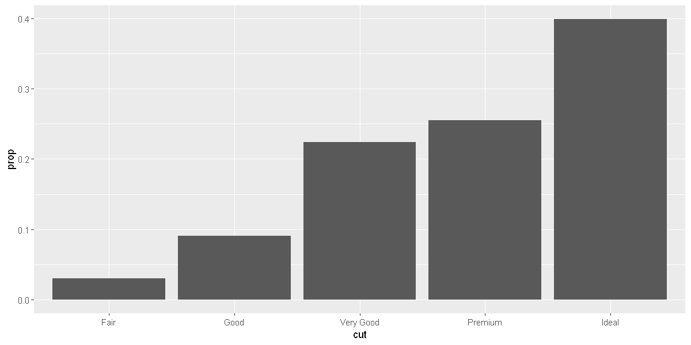
    


```R
# to draw greater attention to the statistical transformation

ggplot(data = diamonds) + 
  stat_summary(
    mapping = aes(x = cut, y = depth),
    fun.min = min,
    fun.max = max,
    fun = median
  )
```


    
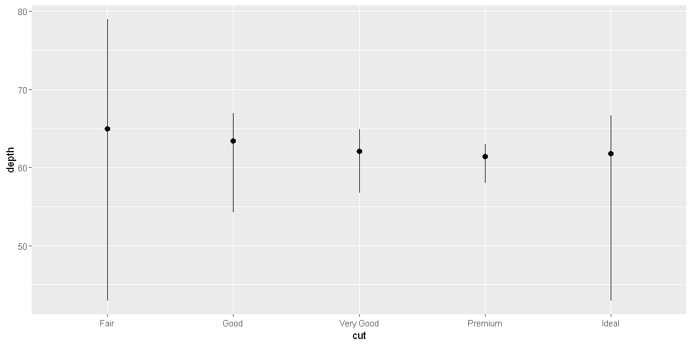
    


```R
ggplot(data = diamonds) + 
  geom_col(mapping = aes(x = cut, y = depth))

options(repr.plot.width = 10, repr.plot.height = 5)
```


    
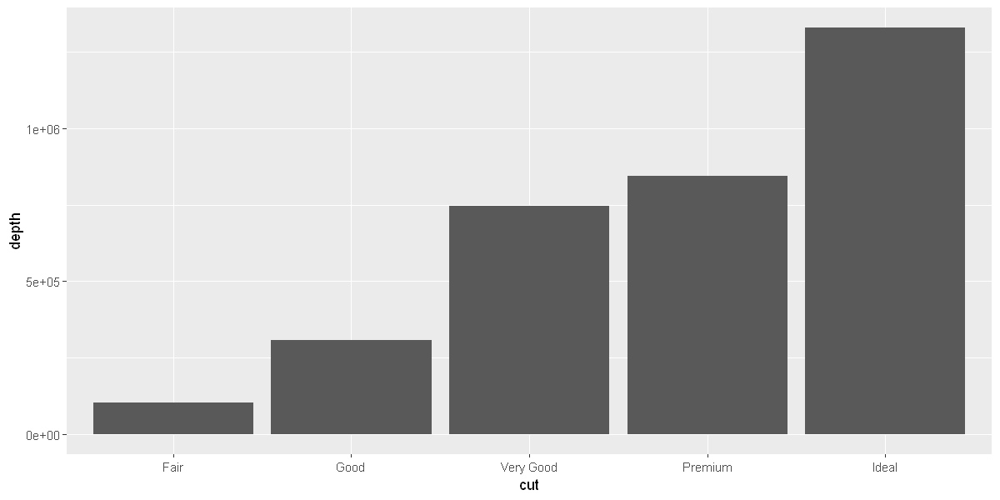
    


## Position Adjustments
There’s one more piece of magic associated with bar charts. You can colour a bar chart using either the `colour` aesthetic, or, more usefully, `fill`:


```R
p1 <- ggplot(data = diamonds) + 
  geom_bar(mapping = aes(x = cut, colour = cut))
p2 <- ggplot(data = diamonds) + 
  geom_bar(mapping = aes(x = cut, fill = cut))

options(repr.plot.width = 20, repr.plot.height = 5)
grid.arrange(p1, p2, ncol=2)
```


    
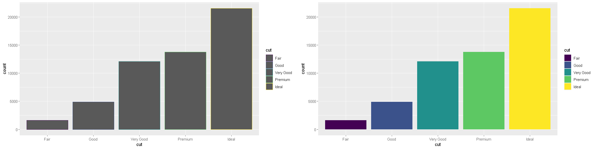
    


Note what happens if you map the fill aesthetic to another variable, like `clarity`: the bars are automatically stacked. Each colored rectangle represents a combination of `cut` and `clarity`.


```R
ggplot(data = diamonds) + 
  geom_bar(mapping = aes(x = cut, fill = clarity))
options(repr.plot.width = 10, repr.plot.height = 5)
```


    
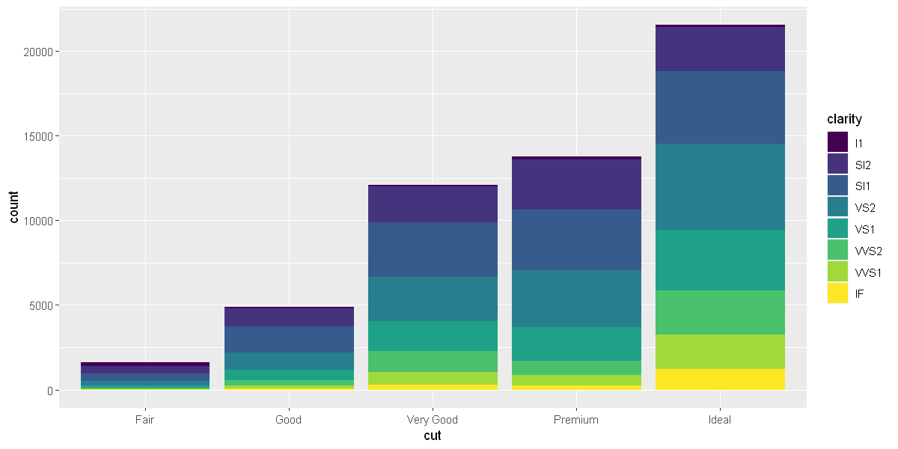
    


The stacking is performed automatically by the **position adjustment** specified by the `position` argument. If you don’t want a stacked bar chart, you can use one of three other options: "`identity`", "`dodge`" or "`fill`".

* `position = "identity"` will place each object exactly where it falls in the context of the graph. This is not very useful for bars, because it overlaps them. To see that overlapping we either need to make the bars slightly transparent by setting `alpha` to a small value, or completely transparent by setting `fill = NA`.


```R
p1 <- ggplot(data = diamonds, mapping = aes(x = cut, fill = clarity)) + 
  geom_bar(alpha = 1/5, position = "identity")

p2 <- ggplot(data = diamonds, mapping = aes(x = cut, colour = clarity)) + 
  geom_bar(fill = NA, position = "identity")

options(repr.plot.width = 20, repr.plot.height = 5)
grid.arrange(p1, p2, ncol=2)
```


    
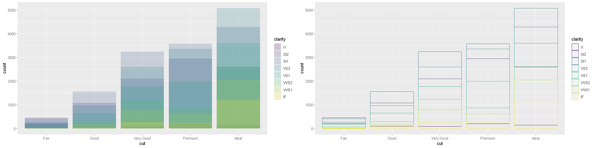
    


* `position = "fill"` works like stacking, but makes each set of stacked bars the same height. This makes it easier to compare proportions across groups.


```R
ggplot(data = diamonds) + 
  geom_bar(mapping = aes(x = cut, fill = clarity), position = "fill")

options(repr.plot.width = 10, repr.plot.height = 5)
```


    
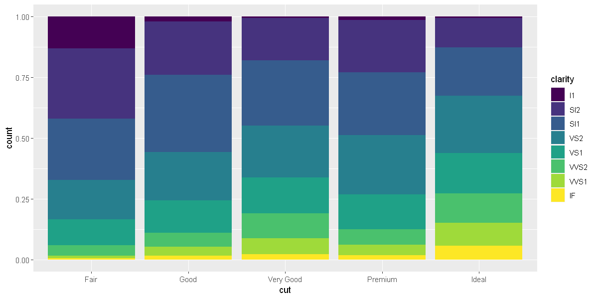
    


* `position = "dodge"` places overlapping objects directly beside one another. This makes it easier to compare individual values.


```R
ggplot(data = diamonds) + 
  geom_bar(mapping = aes(x = cut, fill = clarity), position = "dodge")
```


    
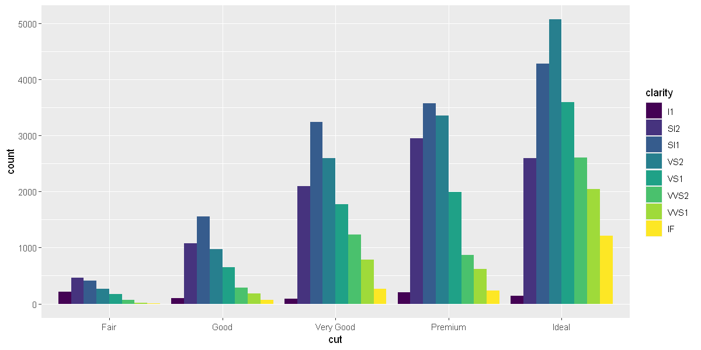
    


* There’s one other type of adjustment that’s not useful for bar charts, but it can be very useful for scatterplots. Recall our first scatterplot, where the values of hwy and displ are rounded so the points appear on a grid and many points overlap each other ( the plot displays only 126 points, even though there are 234 observations in the dataset). This problem is known as **overplotting**.

You can avoid this gridding by setting the position adjustment to `“jitter”`. `position = "jitter"` adds a small amount of random noise to each point. This spreads the points out because no two points are likely to receive the same amount of random noise.
`ggplot2` comes with a shorthand for `geom_point(position = "jitter"): geom_jitter()`.

To learn more about a position adjustment, look up the help page associated with each adjustment: `?position_dodge`, `?position_fill`, `?position_identity`, `?position_jitter`, and `?position_stack`.


```R
ggplot(data = mpg) + 
  geom_point(mapping = aes(x = displ, y = hwy, color = class), position = "jitter")

options(repr.plot.width = 10, repr.plot.height = 5)
```


    
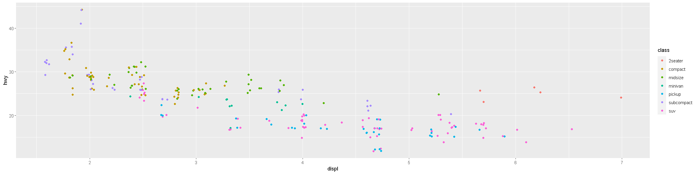
    


```R
# Exercise 3.8
p1 <- ggplot(data = mpg, mapping = aes(x = cty, y = hwy, color = class)) + 
  geom_point()

p2 <- ggplot(data = mpg, mapping = aes(x = cty, y = hwy, color = class)) + 
  geom_jitter() # width = 0.5, height = 0.5

options(repr.plot.width = 20, repr.plot.height = 5)
grid.arrange(p1, p2, ncol=2)
```


    
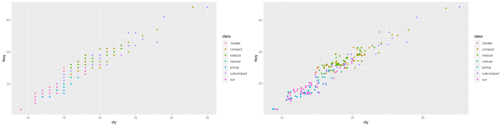
    


```R

ggplot(data = mpg, mapping = aes(x = cty, y = hwy, color=drv)) + 
  geom_boxplot(mapping = aes(group=drv))

options(repr.plot.width = 10, repr.plot.height = 5)
```


    
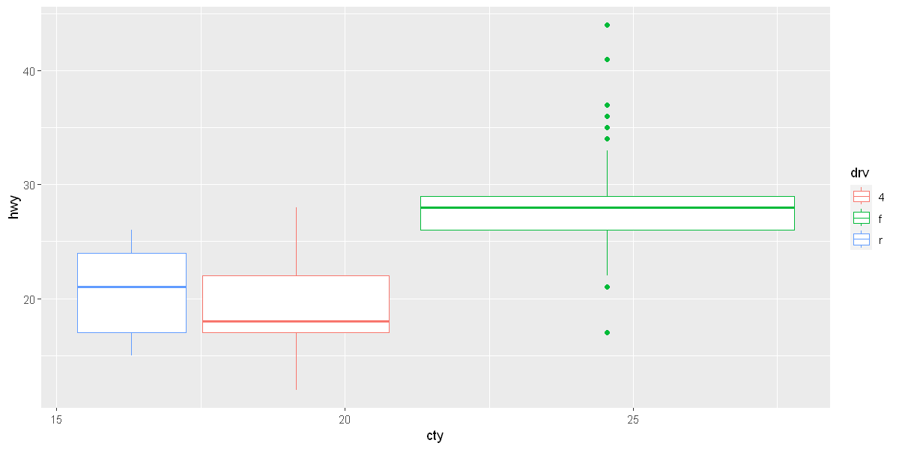
    


## Coordinate systems

Coordinate systems are probably the most complicated part of `ggplot2`. The default coordinate system is the Cartesian coordinate system where the x and y positions act independently to determine the location of each point. There are a number of other coordinate systems that are occasionally helpful.

* `coord_flip()` switches the x and y axes. This is useful (for example), if you want horizontal boxplots. It’s also useful for long labels: it’s hard to get them to fit without overlapping on the x-axis.


```R
p1 <- ggplot(data = mpg, mapping = aes(x = class, y = hwy, color=class)) + 
  geom_boxplot()
p2 <- ggplot(data = mpg, mapping = aes(x = class, y = hwy, color=class)) + 
  geom_boxplot() +
  coord_flip()

options(repr.plot.width = 20, repr.plot.height = 5)
grid.arrange(p1, p2, ncol=2)
```


    
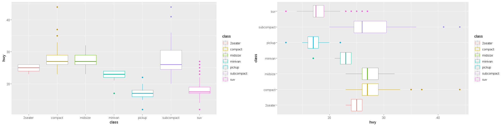
    


* `coord_quickmap()` sets the aspect ratio correctly for maps. This is very important if you’re plotting spatial data with ggplot2 (which unfortunately we don’t have the space to cover in this book).


```R
library(maps) # for coord_quickmap()
library(mapproj) # for coord_map()
```


```R
if (require("maps")) {
    nz <- map_data("nz")

    p1 <- ggplot(nz, aes(long, lat, group = group)) +
        geom_polygon(fill = "white", colour = "black")

    p2 <- ggplot(nz, aes(long, lat, group = group)) +
        geom_polygon(fill = "white", colour = "black") +
        coord_quickmap()

    options(repr.plot.width = 10, repr.plot.height = 5)
    grid.arrange(p1, p2, ncol=2)
}
```


    
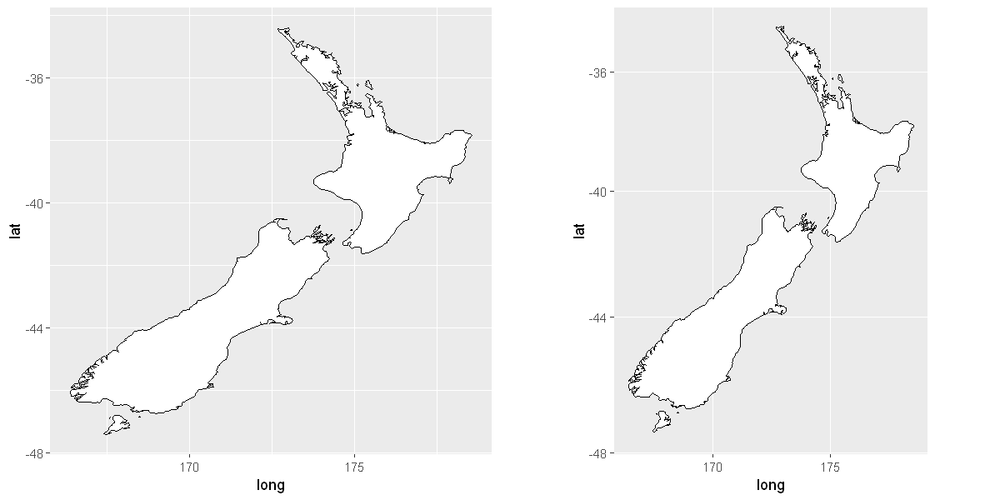
    


```R
nz <- map_data("nz")

p1 <- ggplot(nz, aes(long, lat, group = group)) +
    geom_polygon(fill = "white", colour = "black")

p2 <- ggplot(nz, aes(long, lat, group = group)) +
    geom_polygon(fill = "white", colour = "black") +
    coord_map()

options(repr.plot.width = 10, repr.plot.height = 5)
grid.arrange(p1, p2, ncol=2)
```


    Error in map_data("nz"): could not find function "map_data"
    Traceback:
    


* `coord_polar()` uses polar coordinates. Polar coordinates reveal an interesting connection between a bar chart and a Coxcomb chart.


```R
bar <- ggplot(data = diamonds) + 
  geom_bar(
    mapping = aes(x = cut, fill = cut), 
    show.legend = FALSE,
    width = 1
  ) + 
  theme(aspect.ratio = 1) +
  labs(title = "Using labs", x = "polar", y = "bear")

p1 <- bar + coord_flip()
p2 <- bar + coord_polar()

options(repr.plot.width = 10, repr.plot.height = 5)
grid.arrange(p1, p2, ncol=2)
```


    
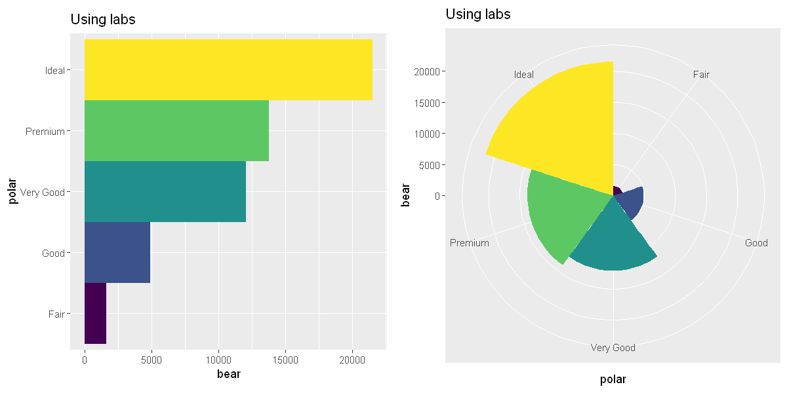
    


```R
# exercises 3.9 What does the plot below tell you about the relationship between city and highway mpg? 
# Why is coord_fixed() important? What does geom_abline() do?
ggplot(data = mpg, mapping = aes(x = cty, y = hwy)) +
  geom_point() + 
  geom_abline() +
  coord_fixed()

```
